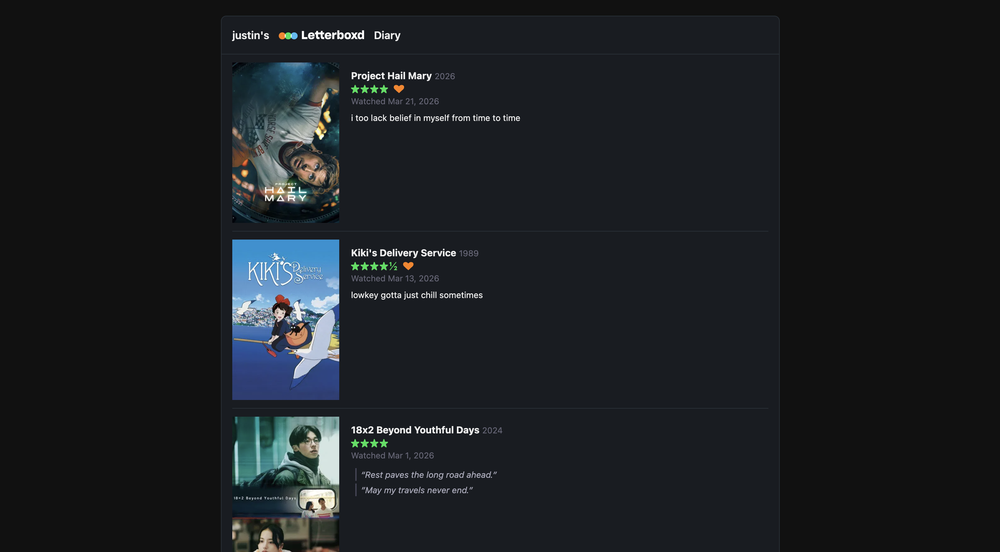

# letterboxd-diary

A React component for embedding your Letterboxd diary on your personal site. Displays your recently watched films as a responsive grid, list, or carousel — with posters, star ratings, heart likes, rewatch indicators, review snippets, and links back to Letterboxd.

Data is fetched via a companion Cloudflare Worker that reads your public Letterboxd RSS feed and enriches it with TMDB poster images. **The component requires the Worker backend to be deployed before it will work.**

---

## Screenshots

 *Desktop — list layout*




---

## Installation

```bash
npm install letterboxd-diary
```

---

## Usage

### 1. Deploy the Worker backend (required)

The component fetches data from a companion Cloudflare Worker — **it will not work without it**. The Worker reads your Letterboxd RSS feed, enriches entries with TMDB poster images, and serves the result as JSON with edge caching.

Full setup instructions are in the worker repo:

**[github.com/justin-gna/letterboxd-diary-worker](https://github.com/justin-gna/letterboxd-diary-worker)**

Clone it, configure your environment variables (Letterboxd username, TMDB API key, allowed origins), and run `npm run deploy`. Wrangler will give you a Worker URL like `https://your-worker.workers.dev`.

### 2. Add your Worker URL as an environment variable

**Vite** (`.env`):
```
VITE_LETTERBOXD_API_URL=https://your-worker.workers.dev
```

**Next.js** (`.env.local`):
```
NEXT_PUBLIC_LETTERBOXD_API_URL=https://your-worker.workers.dev
```

### 3. Add the component

**Vite:**
```tsx
import { LetterboxdDiary } from "letterboxd-diary";

<LetterboxdDiary
  apiUrl={import.meta.env.VITE_LETTERBOXD_API_URL}
  name="Your Name"
  count={6}
  layout="grid"
/>
```

**Next.js:**
```tsx
import { LetterboxdDiary } from "letterboxd-diary";

<LetterboxdDiary
  apiUrl={process.env.NEXT_PUBLIC_LETTERBOXD_API_URL!}
  name="Your Name"
  count={6}
  layout="grid"
/>
```

No CSS import needed — styles are injected automatically.

### Props

| Prop | Type | Default | Description |
|---|---|---|---|
| `apiUrl` | `string` | required | Full URL of your deployed Cloudflare Worker |
| `name` | `string` | required | Display name shown in the widget header |
| `count` | `number` | `6` | Number of diary entries to display |
| `layout` | `"grid" \| "list" \| "carousel"` | `"grid"` | Display layout |
| `showReviews` | `boolean` | `true` | Whether to show review text on cards |
| `minRating` | `number` | — | Only show entries rated this or higher (0.5–5) |
| `reviewsOnly` | `boolean` | — | Only show entries that have a written review |
| `year` | `string` | — | Filter to a specific year watched, e.g. `"2025"` |

The component is responsive — in grid and carousel layouts it adapts column count based on its container width using CSS container queries.

---

## Local development

### Setup

```bash
git clone https://github.com/justin-gna/letterboxd-diary.git
cd letterboxd-diary
npm install
```

### Preview app

The `preview/` directory is a standalone Vite app that renders all three layouts (grid, list, carousel) side by side. It imports directly from `src/` via a path alias, so changes to the library are reflected immediately without a build step.

```bash
# Copy and configure the preview environment
cp preview/.env.example preview/.env
# Edit preview/.env with your deployed Worker URL and display name

# Install preview dependencies and start
cd preview && npm install && npm run dev
```

The preview will be available at `http://localhost:5173`.

To run the preview and the type checker together:

```bash
# Terminal 1 — preview with hot reload
cd preview && npm run dev

# Terminal 2 — continuous type checking
npm run typecheck -- --watch
```

### Running tests

```bash
npm test              # run all tests once
npm run test:watch    # watch mode
npm run coverage      # with coverage report
```

### Building

```bash
npm run build   # outputs compiled library to dist/
```

---

## Inspiration

This project was heavily inspired by [letterboxd-diary-embed](https://github.com/timciep/letterboxd-diary-embed) by [timciep](https://github.com/timciep), which came up with the approach of using Letterboxd's public RSS feed and a Cloudflare Worker to embed diary entries on a personal site.
